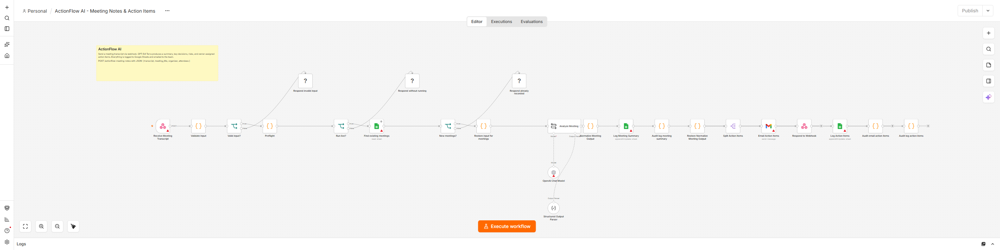

# ActionFlow AI

When an authenticated webhook receives a meeting transcript, save its summary and action items, send a team digest, and stop.

These images show a local n8n editor. Red icons mean credentials still need to be connected on your own instance.

[Webhook and checks](screenshots/n8n-start.png) · [Sheet and digest steps](screenshots/n8n-finish.png)

## What it does

The caller sends a request_id and transcript to actionflow-meeting-notes. The workflow checks the input, asks OpenAI for a summary and actions, then writes to the Meetings and Action Items tabs. It emails the team inbox. Dates use Asia/Manila. A person must confirm owners and deadlines; a vague date should not become a made-up deadline. The workflow does not change calendars or assign work outside Sheets.

Success means a Meetings row keyed by Meeting ID, action rows keyed by meeting and task, and a digest in the n8n execution. The webhook can return accepted after the meeting row but before every action row or email finishes. The meeting organizer or team operations owns this workflow.

## Set up

1. On self-hosted n8n, import ActionFlow AI.json and Failure Alert.json. Connect OpenAI, Google Sheets, Gmail, and a Header Auth credential. Require the caller to send that header over HTTPS. Restrict the Google account to the team sheet and mailbox.
2. Make a Meetings tab with: Meeting ID, Run ID, Date, Title, Organizer, Attendees, Summary, Key Decisions, Risks, Suggested Follow-up, Received At. Make an Action Items tab with: Action Key, Meeting ID, Meeting Title, Owner, Task, Due Date, Priority, Status.
3. Set MEETING_SHEET_ID, MEETING_EMAIL_TO, and ACTIONFLOW_ALERT_EMAIL_TO in the server environment. Keep API keys in n8n credentials. Set N8N_BLOCK_ENV_ACCESS_IN_NODE=false on this dedicated instance so Code nodes can read workflow settings.
4. In the main workflow's n8n Settings, choose Failure Alert as its Error Workflow. Connect its Gmail node and test delivery to the team operator. Rate-limit the webhook at ingress. Set N8N_CONCURRENCY_PRODUCTION_LIMIT=1 to reduce overlapping production runs; manual runs can still overlap.

ACTIONFLOW_ENABLED=true allows a run. Dry run is on unless ACTIONFLOW_DRY_RUN=false. Dry run stops before OpenAI, Sheets, and Gmail. Set ACTIONFLOW_ENABLED=false and deactivate the workflow to stop new requests.

## Test before using real meetings

1. Run python smoke_test.py after edits. It exits nonzero on failure. GitHub Actions runs it on pushes and pull requests.
2. Enable the flag and leave dry run on. POST a sample request with Header Auth; confirm dry_run and no external calls.
3. Use a test sheet and inbox, set ACTIONFLOW_DRY_RUN=false, and POST a sample with a stable request_id. Check both tabs and Gmail. POST it again; check that no second digest appears.
4. Test an empty transcript, a meeting with no action items, and Failure Alert delivery.

Example request after you set your own URL and Header Auth token:

    curl -X POST https://YOUR-N8N/webhook/actionflow-meeting-notes -H 'Content-Type: application/json' -H 'X-Workflow-Key: YOUR-TOKEN' -d '{"request_id":"meeting_123","transcript":"Alice: Bob, please finish the report by Friday."}'

## If something fails

n8n logs the time, run ID, and result; Failure Alert emails ACTIONFLOW_ALERT_EMAIL_TO. An accepted webhook means only that the meeting row was saved. If action rows or email fail, check the execution, both tabs, and Gmail Sent before repairing the missing work by hand. A rerun with the same request_id stops at the meeting row and will not repair later steps. Do not retry Gmail after an uncertain timeout without checking Sent.

The workflow has a 300 second run limit and a 30 second AI timeout. Sheet and Gmail writes are not retried after an uncertain result. Sheets lookup and upsert do not enforce unique keys across simultaneous requests. If n8n is offline, the caller must retry later using the same request_id. Monitor n8n from outside because its own alert cannot report an outage.

Review the owner, inbox, sheet, and meeting process every quarter. Retire the workflow when that process ends. Test with real account connections before routing meetings to it.

## Go-live check

- [ ] Dry run was tested; it touched no live account.
- [ ] Secrets are in n8n credentials, and required environment settings are present.
- [ ] The same item was run twice in a test account with no duplicate side effect.
- [ ] Timeouts and retry limits were checked; uncertain Gmail or Sheets writes are reviewed by a person.
- [ ] Failure Alert reaches the named operator, and an outside monitor covers n8n outages.
- [ ] The operator knows how to set ACTIONFLOW_ENABLED=false and deactivate the workflow.\n
